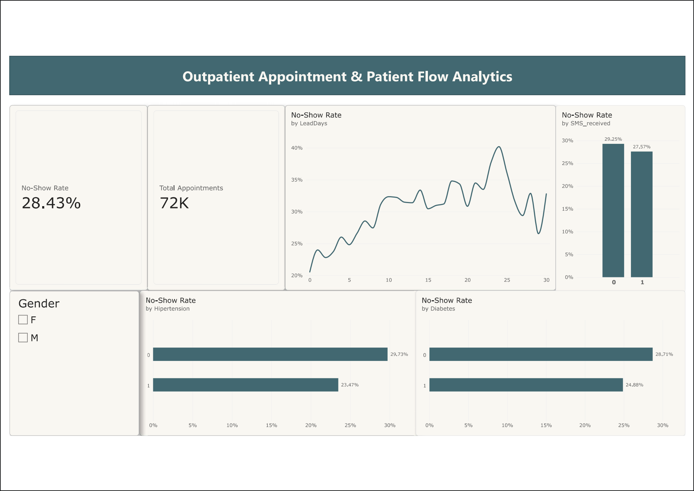

# Outpatient Appointment & Patient Attendance Analytics

An end-to-end healthcare operational analytics dashboard built with **Microsoft Power BI**, **Power Query (M)**, and **DAX**. This project analyzes **72,000+ clinical appointment records** to uncover behavioral drivers behind patient no-shows, optimize clinic capacity utilization, and formulate data-driven scheduling strategies.

---

## Executive Dashboard Preview



---

## Executive Summary & Problem Statement

Outpatient no-shows represent a significant operational and financial challenge for healthcare providers, resulting in underutilized clinical capacity, disrupted physician scheduling, and extended patient wait times. 

The primary objective of this project is to:
1. Identify demographic and behavioral patterns contributing to missed appointments.
2. Quantify the impact of scheduling lead time and chronic condition management on patient compliance.
3. Deliver an intuitive, executive-ready Power BI dashboard to support clinic managers in resource planning and overbooking strategies.

---

## Key Business Insights

* **The Lead Time Effect**:
  * Same-day appointments demonstrate near-perfect compliance, with attendance exceeding **95%**.
  * As the booking window extends beyond **15 days**, the no-show rate rises steadily, surging past **30%**. Long wait horizons directly correlate with patient forgetfulness and scheduling conflicts.
* **Chronic Condition Adherence**:
  * Patients diagnosed with **Hypertension** and **Diabetes** consistently exhibit lower no-show rates (~4% below the general baseline).
  * Routine clinical management and dependency on prescription refills establish strong healthcare adherence among chronic cohorts.
* **Intervention Efficacy & Marginal Returns**:
  * Automated SMS notifications show marginal efficacy in standalone attendance improvements, indicating that generic text reminders are insufficient for high-risk, long-lead-time appointments without personalized engagement.

---

## Data Architecture & Modeling

### 1. Data Processing (Power Query / ETL)
* Sanitized raw operational logs, addressing anomalies such as negative appointment lead times (`LeadDays < 0`).
* Deduplicated records and validated data types across demographic, diagnostic, and appointment attributes.
* Established a normalized schema separating transactional appointment logs from analytical measure calculations.

### 2. Analytical Measures (DAX)
Implemented custom DAX formulas stored in a dedicated `_Measures` table:

* **No-Show Rate**:
  ```dax
  No-Show Rate = 
  DIVIDE(
      CALCULATE(COUNTROWS('Fact_Appointments'), 'Fact_Appointments'[No-show] = "Yes"),
      COUNTROWS('Fact_Appointments'),
      0
  )
 * **Total Appointments**:
  ```dax
  Total Appointments = COUNTROWS('Fact_Appointments')
```

---

## UI/UX & Dashboard Design System

* **Card-Based Visual Hierarchy**: Structured with discrete content containers using subtle drop shadows and 8px border radii for elevated depth.
* **Executive Color Palette**: Designed with a slate-teal focus hue, muted cool-grey canvas background (`#F4F6F9`), and high-contrast typography to ensure accessible readability and reduce visual fatigue.
* **Interactive Filtering**: Dynamic cross-filtering enabled across demographic cohorts (Gender) and chronic conditions (Hypertension, Diabetes) for granular root-cause analysis.

---

## Operational & Strategic Recommendations

1. **Tiered Overbooking Model**: Introduce dynamic overbooking ratios (15%–20% capacity expansion) specifically for scheduling slots with lead times exceeding two weeks.
2. **Targeted Confirmation Protocols**: Transition from passive SMS broadcasts to interactive confirmation prompts and proactive outreach for high-risk demographics.
3. **Queue Prioritization**: Allocate flexible short-lead slots for acute primary care visits while reserving structured recurring slots for chronic disease follow-ups.

---

## Repository Structure

```text
├── Outpatient_NoShow_Analytics.pbix   # Primary Power BI project file (Data model & visuals)
├── Outpatient_NoShow_Analytics.png    # High-resolution dashboard screenshot
└── README.md                          # Project documentation and analytical breakdown
```

---

## Author
* **Guangxian Zhou**
* Focus: Business Administration & Data Analytics
